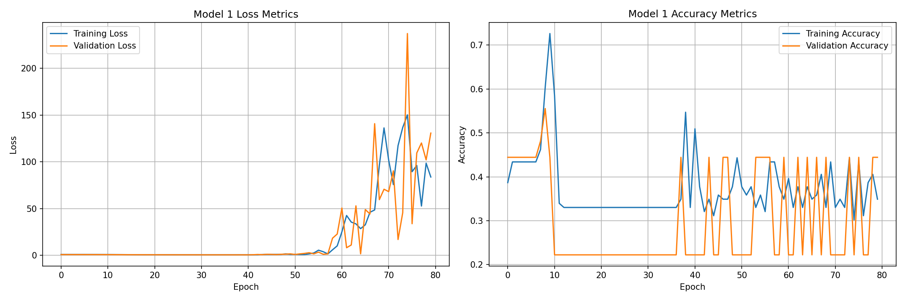
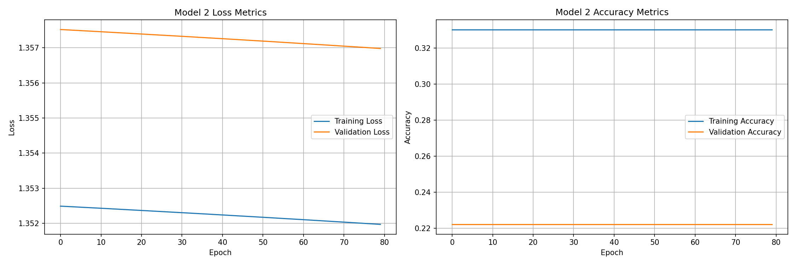

### Analiza wyników klasyfikacji (Wine)

Poniżej znajdują się dwa wykresy z metrykami uczenia (strata i dokładność) dla dwóch modeli sieci neuronowych trenowanych na zbiorze Wine (3 klasy, cechy chemiczne wina). Oba modele były trenowane z podziałem 80%/20% na zbiory treningowy/testowy oraz `validation_split=0.2` dla walidacji podczas uczenia.

#### Model 1 — opis
- Architektura (Dense + ReLU): 8 → 16 → 13 → 10 → 8 → 5 → 3 (Softmax)
- Inicjalizatory: `kernel_initializer = random_normal`, `bias_initializer = zeros`
- Optymalizator: `Adam`, `learning_rate = 0.001`
- Funkcja straty: `CategoricalCrossentropy(from_logits=False)`
- Epoki: `80`, Rozmiar batcha: `32`
- Walidacja: `validation_split = 0.2`

Wykresy poniżej pokazują, jak zmieniała się strata (loss) i dokładność (accuracy) w czasie dla zbioru treningowego i walidacyjnego.

#### Model 2 — opis
- Architektura (Dense + ReLU): 8 → 16 → 13 → 10 → 8 → 5 → 3 (Softmax)
- Inicjalizatory: `kernel_initializer = random_uniform`, `bias_initializer = he_normal`
- Optymalizator: `Adadelta`, `learning_rate = 0.001`
- Funkcja straty: `CategoricalCrossentropy(from_logits=False)`
- Epoki: `80`, Rozmiar batcha: `64`
- Walidacja: `validation_split = 0.2`

Wykresy poniżej prezentują porównanie metryk dla nauki i walidacji w trakcie epok dla Modelu 2.

Uwagi:
- Pierwszy model naprzemiennie traci dokładność i zwrasta w nim ilość pomyłek, dzieje się tak ponieważ dochodzi do nadmiernego dopasowania
- Dokładność drugiego modelu się nie zmienia, dlatego, że learning_rate jest w jego przypadku zbyt mały. Domyślnie jest to 1.0. Nieco szybciej spada ilość pomyłek.
